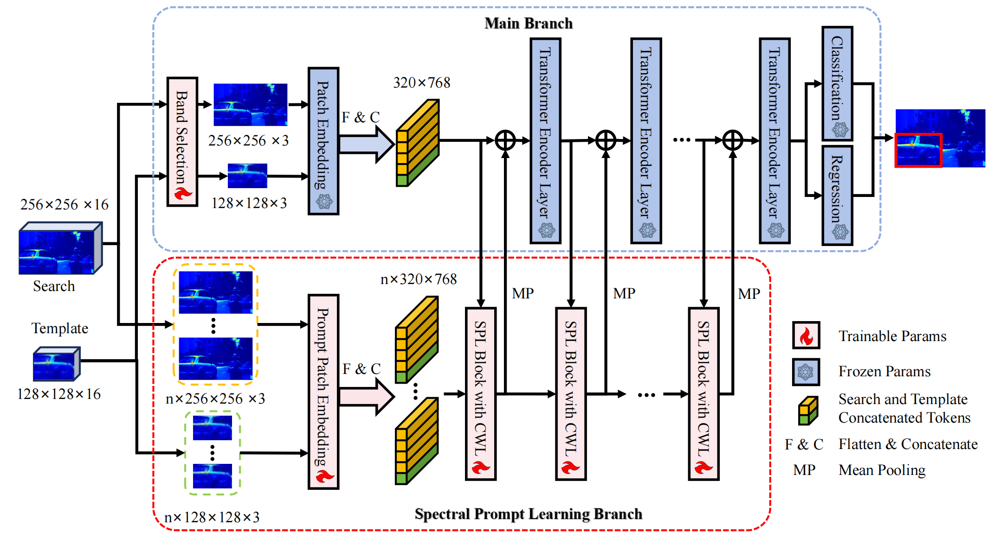

# Hyperspectral Object Tracking with Spectral Information Prompt (SP-HST)
Our Model Weight: [HOTC2020](https://pan.baidu.com/s/1v7ZyYo8-6YTLgyv9LHzamg) and [IMEC25](https://pan.baidu.com/s/12_m3QyIFErGSkjDjif8h2g)  
Pretrain model: [OSTrack](https://github.com/botaoye/OSTrack)  
Raw Result: [HOTC2020](https://pan.baidu.com/s/1MsnOiCP427rbbUj5F439Xw) and [IMEC25](https://pan.baidu.com/s/18NakYEEu9XDPVHfGgV7AYg)  




## Usage

### Installation  
Create and activate a conda environment, we've tested on this env: You can follow the env setting of [OSTrack](https://github.com/botaoye/OSTrack) and [ViPT](https://github.com/jiawen-zhu/ViPT).   

### Data Preparation  
* Hyperspectral training and test datasets:  
  * [HOTC2020](https://www.hsitracking.com/hot2020/)
  * [IMEC25](https://github.com/Chenlulu1993/HOMG)

### Path Setting  
Following [OSTrack](https://github.com/botaoye/OSTrack)

### Testing  
```
python SPHST_workspace/test.py
```

### Training  
```
python tracking/train.py
```

## Citation  
```
@article{gao2024hyperspectral,
  title={Hyperspectral Object Tracking with Spectral Information Prompt},
  author={Gao, Long and Chen, Langkun and Jiang, Yan and Xie, Weiying and Li, Yunsong},
  journal={Authorea Preprints},
  year={2024},
  publisher={Authorea}
}
```
